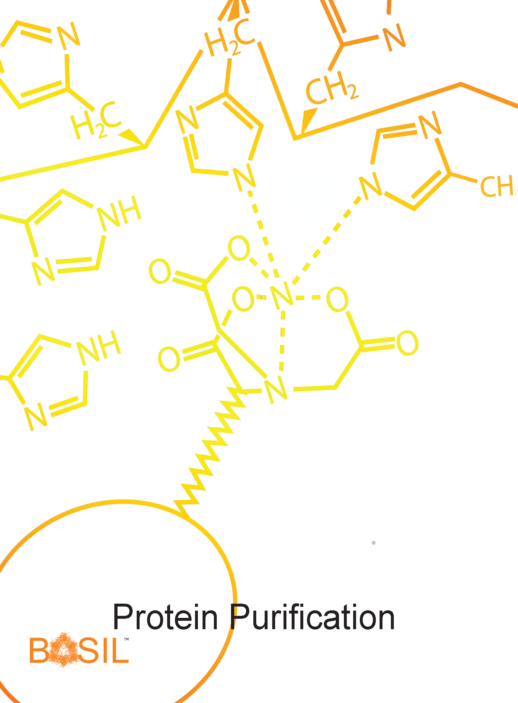

Protein purification is used to isolate a protein of interest from all other cellular components. In this study, purification includes extracting all proteins from a cell pellet, removing debris such as cell membranes and nucleic acids, and performing appropriate affinity chromatography, which is possible because the protein of interest has a tag for the purpose. Techniques for this exercise include sonication, centrifugation, and chromatography. Students will assess the purity of the protein in a subsequent experiment with SDS-PAGE. If purification was not successful, students will have to identify potential reasons why and test their hypothesis by repeating purification.  The correct protein must be properly tracked throughout the procedure as it is not visible to the human eye. Protein purification is dependent on the successful completion of protein expression and likewise, the only way to determine if protein purification was successful is by completion of all subsequent labs.
   

> ## Module Resources
>[Download student module here](https://docs.google.com/document/d/e/2PACX-1vQu5Anq-_cRZ_B6e90WnEaLhvQ3braqnybKXtcsPilt5gb1K2cwi1akOujp-BEpa_95K87GFgicVpol/pub)
{: .callout}
