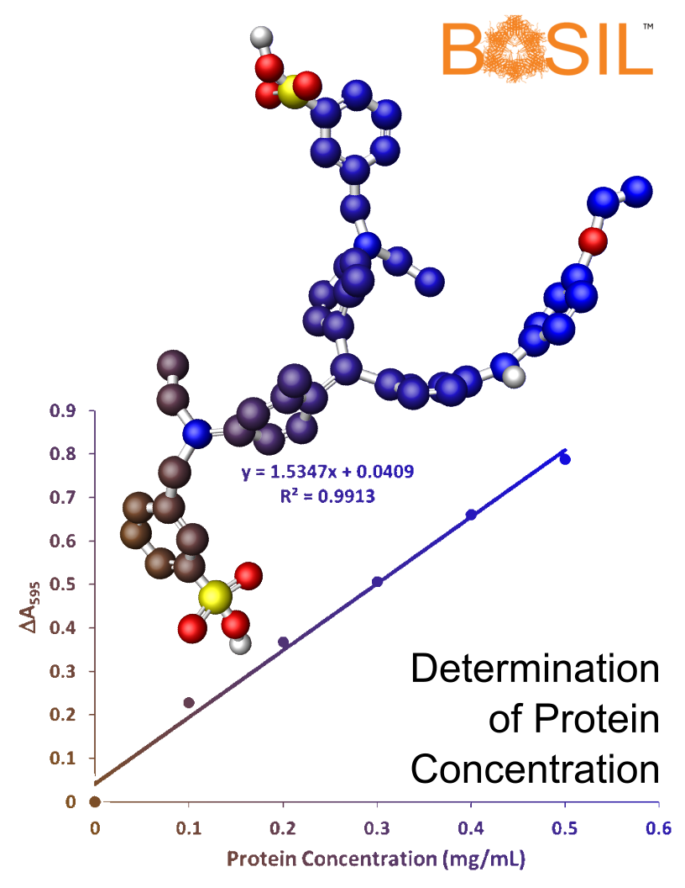

The determination of protein concentration is an essential skill for biochemists. In earlier BASIL modules, students learned how to express and purify enzymes of unknown function. Determination of protein concentration by a dye-binding assay will enable students to characterize their enzymes in later modules. In the process students will also gain practice with accuracy and precision in pipetting, and data analysis.  At the end of this module, students will have gained both practical and analytical skills that will prepare them for future lab work.
   

> ## Module Resources
>[Download student module here](https://docs.google.com/document/d/e/2PACX-1vRt6EYjqzySOzgZS-v3gE2qQDfiTYzY1kKUiHfJYVGVCdHMXuElEJaxThXAjjDMJzJbUi69_7KMY1Em/pub)
{: .callout}
