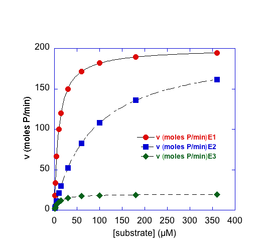

Protein kinetic assays are used to quantify the process of enzymatic conversion of a substrate to a product. This quantification provides very useful data towards understanding specificity of enzymes towards their substrates. Kinetic assays also help identify inhibitors and lead to enzyme mechanism information. This module describes the process for obtaining kinetic data for both chymotrypsin and a protein of interest for cleavage of para-nitrophenylacetate to obtain KM and Vmax values.
   

> ## Module Resources
>[Download student module here](https://docs.google.com/document/d/e/2PACX-1vSMWy870E1N0dyXjJasuWysWxyzuQqzvGPELWCH1hej2aUAiuYtBqoyeykG7UkP_DwHhMM7nQnUvNHh/pub)
{: .callout}
