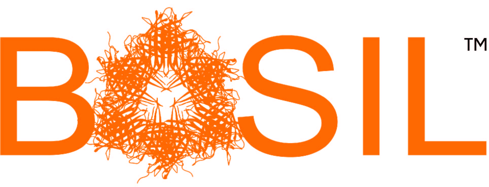

  

    
  

  

    
<a href="{{ site.basil_site }}">The BASIL biochemistry consortium</a> is a group of chemistry and biochemistry faculty who work to promote
    CURES in the biochemistry curriculum.

    <h2>Contributors</h2>
    <ul>
    <li>Paul A. Craig, Rochester Institute of Technology</li>
    <li>Herbert J. Bernstein, Rochester Institute of Technology</li>
    <li>Colette Daubner, St. Mary's University</li>
    <li>Anya Goodman, Cal Poly San Luis Obispo</li>
    <li>Stefan M. Irby, Purdue University</li>
    <li>Julia R. Koeppe, State University of New York at Oswego</li>
    <li>Jeffrey L. Mills, Rochester Institute of Technology</li>
    <li>Suzanne F. O’Handley, Rochester Institute of Technology</li>
    <li>Michael Pikaart, Hope College</li>
    <li>Ashley Ringer McDonald, Cal Poly San Luis Obispo</li>
    <li>Rebecca Roberts, Ursinus College</li>
    <li>Arthur Sikora, Nova Southeastern University</li>
    </ul>
  

 


